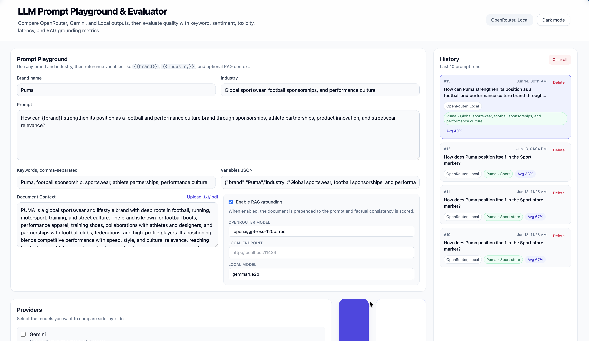
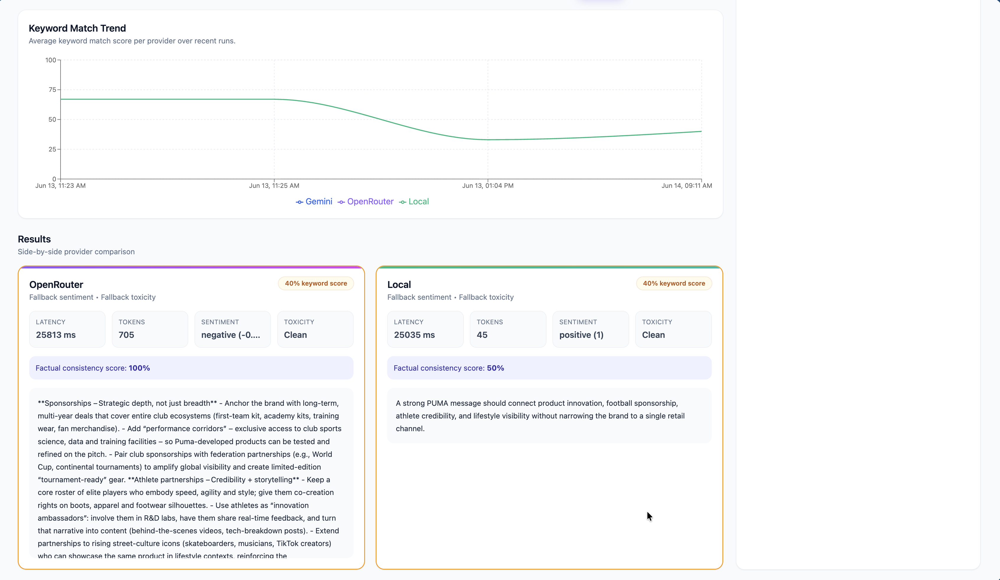
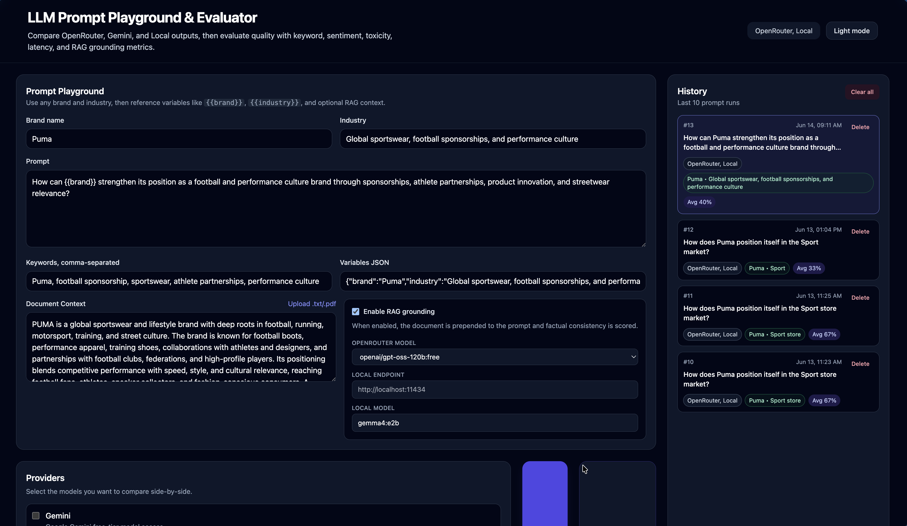
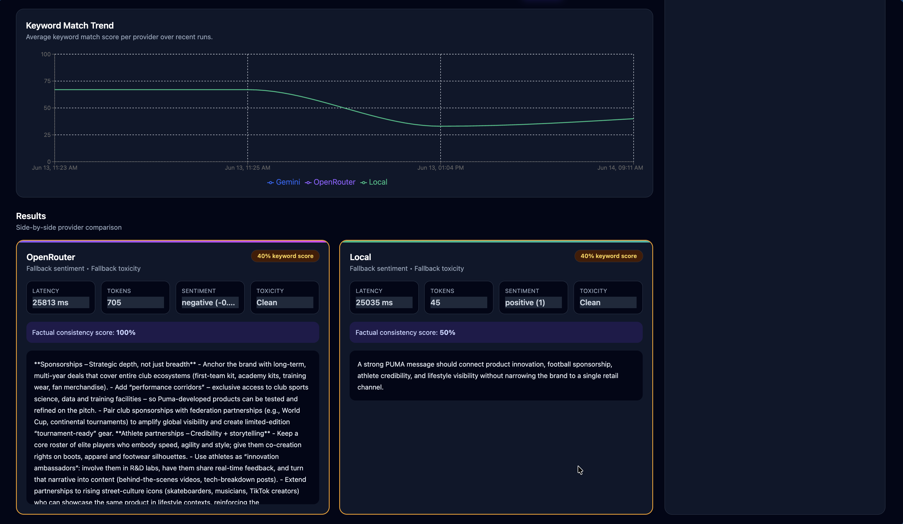

# LLM Prompt Playground & Evaluator

A full-stack TypeScript project for comparing prompts across multiple LLM providers and evaluating response quality with quantitative metrics.

## What this project does

A **prompt playground** lets users write a prompt, add optional context, run it against several LLM providers, and compare outputs side-by-side. Evaluation matters because AI engineering is not only about generating text; it is about measuring whether outputs are accurate, grounded, safe, and aligned with brand goals.

This app supports:

- Brand and industry fields for reusable prompts across any market
- Prompt variables such as `{{brand}}` and `{{industry}}`
- Provider comparison for OpenRouter, Gemini, and optional Local models
- RAG-style grounding by prepending document context
- Quantitative evaluation metrics with Hugging Face sentiment and toxicity analysis when configured
- SQLite-backed history
- A React dashboard with charts
- Downloadable PDF reports for completed evaluations
- Mock mode for local testing without API keys
- GitHub Actions AI evaluation checks

## Screenshots

### Main Dashboard




### Dark Mode




## Project structure

```text
llm-prompt-playground-evaluator/
├── .github/
│   └── workflows/
│       └── evaluate.yml
├── backend/
│   ├── package.json
│   ├── tsconfig.json
│   └── src/
│       ├── database.ts
│       ├── evaluation.ts
│       ├── index.ts
│       ├── types.ts
│       └── llm/
│           ├── gemini.ts
│           ├── index.ts
│           ├── local.ts
│           └── mock.ts
├── frontend/
│   ├── index.html
│   ├── package.json
│   ├── postcss.config.js
│   ├── tailwind.config.js
│   ├── tsconfig.json
│   ├── tsconfig.node.json
│   ├── vite.config.ts
│   └── src/
│       ├── App.tsx
│       ├── index.css
│       ├── main.tsx
│       ├── types.ts
│       ├── components/
│       │   ├── HistorySidebar.tsx
│       │   ├── MetricsChart.tsx
│       │   ├── PromptInput.tsx
│       │   ├── ProviderSelector.tsx
│       │   ├── ResultCard.tsx
│       │   └── ToastContainer.tsx
│       └── lib/
│           └── api.ts
├── scripts/
│   └── evaluate-ai.ts
├── test-prompts.json
├── package.json
├── tsconfig.json
├── .env.example
├── .env.keys.example
└── README.md
```

## Setup

### 1. Clone the repository

```bash
git clone <your-repo-url>
cd llm-prompt-playground-evaluator
```

### 2. Install dependencies

```bash
npm install
```

### 3. Create environment files

Copy the example environment file for non-secret configuration:

```bash
cp .env.example .env
```

Create a separate key file and add your API keys there:

```bash
cp .env.keys.example .env.keys
```

```env
# .env.example
OPENROUTER_MODEL=google/gemma-4-31b-it:free
PORT=3001
DATABASE_URL=./playground.db
MOCK_MODE=false
HUGGINGFACE_SENTIMENT_MODEL=distilbert-base-uncased-finetuned-sst-2-english
HUGGINGFACE_TOXICITY_MODEL=unitary/toxic-bert
HUGGINGFACE_TOXICITY_THRESHOLD=0.5
HUGGINGFACE_TIMEOUT_MS=5000
```

```env
# .env.keys, gitignored
OPENROUTER_API_KEY=your_openrouter_key
GEMINI_API_KEY=your_gemini_key
HUGGINGFACE_API_KEY=your_huggingface_key
```

Get API keys from:

- OpenRouter: https://openrouter.ai/keys
- Google AI Studio: https://aistudio.google.com/
- Hugging Face: https://huggingface.co/settings/tokens

The default UI providers are OpenRouter and Local LLM. If `OPENROUTER_API_KEY` is missing, or if `MOCK_MODE=true`, the backend returns mock responses so the UI can still be tested without paid dependencies.

### 4. Run the app

```bash
npm run dev
```

The backend runs on `http://localhost:3001`. The frontend runs on `http://localhost:5173`.

## Available scripts

```bash
npm run dev          # Start backend and frontend concurrently
npm run build        # Build backend and frontend for production
npm run typecheck    # Run TypeScript checks for both apps
npm test             # Run AI evaluation checks from test-prompts.json
npm run test:ai      # Same as npm test
```

## API endpoints

### `POST /api/playground`

Accepts JSON:

```json
{
  "prompt": "How can {{brand}} strengthen its position as a football and performance culture brand through sponsorships, athlete partnerships, product innovation, and streetwear relevance?",
  "providers": ["openrouter", "local"],
  "keywords": ["Puma", "football sponsorship", "sportswear", "athlete partnerships", "performance culture"],
  "contextDocument": "PUMA is a global sportswear and lifestyle brand with deep roots in football, running, motorsport, training, and street culture. The brand is known for football boots, performance apparel, training shoes, collaborations with athletes and designers, and partnerships with football clubs, federations, and high-profile players. Its positioning blends competitive performance with speed, style, and cultural relevance, reaching football fans, athletes, sneaker collectors, and fashion-conscious consumers. A strong PUMA message should connect product innovation, football sponsorship, athlete credibility, and lifestyle visibility without narrowing the brand to a single retail channel.",
  "ragEnabled": true,
  "brandName": "Puma",
  "industry": "Global sportswear, football sponsorships, and performance culture",
  "variables": {
    "brand": "Puma",
    "industry": "Global sportswear, football sponsorships, and performance culture"
  }
}
```

Also supports multipart form data for `.txt` and `.pdf` document uploads.

Returns:

```json
{
  "runId": 1,
  "latencyMs": 1842,
  "results": [
    {
      "provider": "openrouter",
      "responseText": "...",
      "latencyMs": 1204,
      "tokenCount": 91,
      "keywordScore": 100,
      "sentiment": {
        "label": "positive",
        "score": 0.67
      },
      "toxicityFlag": false,
      "factualConsistencyScore": 100
    }
  ]
}
```

### `GET /api/history`

Returns the last 10 prompt runs with responses and metrics.

Optional query:

```text
GET /api/history?limit=10
```

### `GET /api/history/:id`

Returns one stored run by ID.

### `GET /api/health`

Returns API health status.

## Evaluation metrics

### Response length / token estimate

Token count is estimated with a lightweight heuristic:

```text
1 token ≈ 4 characters
```

This keeps the project dependency-light and fast.

### Latency

Latency is measured from immediately before the provider call to immediately after the full response is received.

### Keyword Match Score

The user can provide up to 10 keywords. The score is:

```text
matched keywords / total keywords * 100
```

Example:

```text
Keywords: Puma, football sponsorship, sportswear
Response mentions: Puma, sportswear
Score: 66%
```

### Sentiment Score

Sentiment is evaluated with the Hugging Face model configured by `HUGGINGFACE_SENTIMENT_MODEL` when `HUGGINGFACE_API_KEY` is available. If the Hugging Face call is unavailable, the project falls back to the lightweight lexicon-based scorer. The output is:

- `-1` to `+1` numeric score
- `positive`, `negative`, or `neutral` label

### Toxicity Flag

Toxicity is evaluated with the Hugging Face model configured by `HUGGINGFACE_TOXICITY_MODEL` when `HUGGINGFACE_API_KEY` is available. A response is flagged when any prediction label contains a toxic category and its score is at or above `HUGGINGFACE_TOXICITY_THRESHOLD`. If the Hugging Face call is unavailable, the project falls back to the lightweight keyword blacklist.

### Factual Consistency Score

When RAG is enabled, the backend extracts capitalized or uppercase entities from the document context and checks whether the response mentions them.

Example context:

```text
Puma is a global sports and lifestyle brand known for football boots, running shoes, training apparel, motorsport partnerships, and lifestyle collaborations.
```

Entities include `Puma`. If the response mentions it, factual consistency is high.

## RAG implementation

The RAG implementation is intentionally simple and transparent:

1. User pastes text or uploads a `.txt` or `.pdf`.
2. The backend extracts text from the file.
3. If RAG is enabled, the backend prepends the context to the prompt:

```text
Context: <document text>

Answer based only on the context: <user prompt>
```

4. Long context is truncated with a sliding-style summary that keeps the beginning and end of the document.

This is not a vector database implementation. It is a practical baseline that demonstrates grounded prompting, evaluation, and history tracking without paid infrastructure.

## Multi-model comparison

The app compares providers in parallel:

- **OpenRouter** — uses the OpenAI-compatible chat completions endpoint with `OPENROUTER_API_KEY` and `OPENROUTER_MODEL`
- **Gemini** — uses `@google/generative-ai`
- **Local LLM** — optional OpenAI-compatible endpoint such as Ollama or LM Studio

Default selected providers are OpenRouter and Local. The local model defaults to `gemma4:e2b`.

OpenRouter model options:

```text
google/gemma-4-31b-it:free
openai/gpt-oss-120b:free
meta-llama/llama-3.3-70b-instruct:free
nex-agi/nex-n2-pro:free
```

Local LLM example:

```text
Endpoint: http://localhost:11434
Model: gemma4:e2b
```

## Mock mode

Mock mode is useful for demos, CI, and offline development.

The backend returns mock responses when:

- `MOCK_MODE=true`
- a provider API key is missing
- the GitHub Actions evaluation workflow, which forces mock responses for deterministic checks

This allows the UI and evaluation pipeline to run without paid dependencies.

## CI/CD pipeline

The GitHub Actions workflow is defined in:

```text
.github/workflows/evaluate.yml
```

It runs on pushes and pull requests to `main`.

Pipeline steps:

1. Checkout code
2. Install dependencies
3. Run TypeScript checks
4. Run AI evaluation checks from `test-prompts.json`

The evaluation script runs predefined prompts and fails the build if any provider falls below the configured keyword match threshold.

Example threshold:

```json
"expectedMinimumScore": 60
```

In CI, mock responses are used unless real API keys are provided through GitHub Secrets:

```text
OPENROUTER_API_KEY
GEMINI_API_KEY
```

## Architecture diagram

```text
┌──────────────────────┐
│ React + Vite UI      │
│ PromptInput          │
│ ProviderSelector     │
│ ResultCard           │
│ HistorySidebar       │
│ MetricsChart         │
└──────────┬───────────┘
           │ fetch /api/*
           ▼
┌──────────────────────┐
│ Express API          │
│ POST /api/playground │
│ GET /api/history     │
│ GET /api/history/:id │
└──────────┬───────────┘
           │
           ├──────────────────────┐
           ▼                      ▼
┌──────────────────────┐  ┌──────────────────────┐
│ LLM Providers        │  │ Evaluation Engine    │
│ OpenRouter           │  │ Keyword score        │
│ Gemini               │  │ Sentiment            │
│ Local LLM optional   │  │ Toxicity flag        │
└──────────────────────┘  │ Factual consistency  │
                          └──────────┬───────────┘
                                     ▼
                          ┌──────────────────────┐
                          │ SQLite Database      │
                          │ runs                 │
                          │ responses            │
                          └──────────────────────┘
```

## Known limitations

- RAG uses context injection, not vector search.
- Sentiment and toxicity use Hugging Face when configured, with lightweight fallback scoring otherwise.
- Toxicity detection is a simple model threshold plus fallback keyword check and should not be treated as a production safety classifier.
- Factual consistency checks entity mentions, not deep claim verification.
- Responses are not streamed.
- PDF parsing is included, but large PDFs are truncated for simplicity.
- Local LLM support assumes an OpenAI-compatible chat completions endpoint.

## Future improvements

- Add real vector search with embeddings.
- Add streaming responses using Server-Sent Events.
- Add custom evaluation rubrics and rubric scoring.
- Add more providers such as OpenAI, Anthropic, Mistral, or Cohere.
- Add authentication and user-specific history.
- Add exportable evaluation reports.
- Add model cost tracking.
- Add pairwise LLM-as-judge evaluation with clear prompts and calibration.